# Employee ETL Pipeline — Manual Build vs. CloudFormation + CI/CD

This repository documents an S3 → Lambda → AWS Glue (Job + Crawler) → Glue
Data Catalog ETL pipeline, built two ways:

1. **Part A** — the original pipeline, built manually through the AWS Console.
2. **Part B** — the same pipeline, fully automated with AWS CloudFormation and
   deployed/destroyed via GitHub Actions CI/CD.

Both produce the same end result: a CSV dropped into an S3 input bucket is
automatically enriched with a `bonus` column and written to an output bucket,
with the result also cataloged in AWS Glue.

---

## Architecture

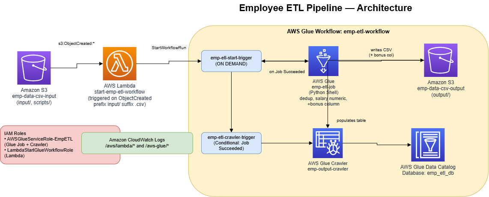

*S3 (input/) → Lambda → Glue Workflow (Job → Crawler) → S3 (output/) + Glue
Data Catalog. IAM roles and CloudWatch Logs support the Glue Job/Crawler and
Lambda respectively (shown as side annotations in the diagram).*

---

## Part A — Manual Build (AWS Console)

This section walks through the pipeline exactly as it was first built by hand,
step by step, with screenshots of each stage.

### Step 1 — S3 Buckets

Created two buckets in `ap-southeast-2` (Asia Pacific – Sydney):


| Bucket                | Purpose                 | Folders              |
| ----------------------- | ------------------------- | ---------------------- |
| `emp-data-csv-input`  | Input CSVs + ETL script | `input/`, `scripts/` |
| `emp-data-csv-output` | ETL output              | `output/`            |

Both buckets: SSE-S3 default encryption enabled, all 4 Block Public Access
settings enabled.

> 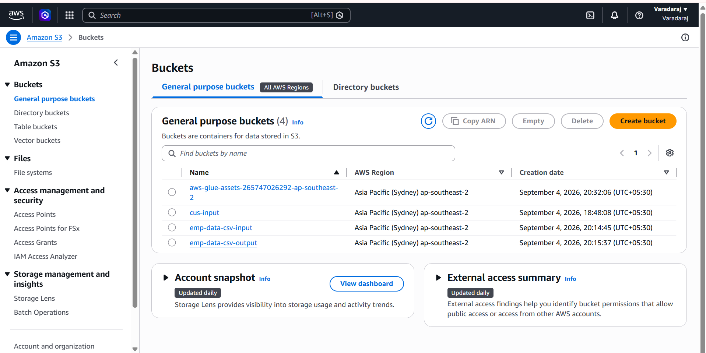
> *Both buckets created in ap-southeast-2 with folder structure.*

---

### Step 2 — IAM Roles

**Glue role — `AWSGlueServiceRole-EmpETL`**
Trust policy: `glue.amazonaws.com`. Inline policy
(`GlueETLLeastPrivilegePolicy`) granting:

- `s3:ListBucket` on both buckets
- `s3:GetObject` on `input/*` and `scripts/*`
- `s3:PutObject` / `s3:GetObject` on output bucket
- Glue Data Catalog actions (`GetDatabase`, `CreateDatabase`, `CreateTable`,
  `UpdateTable`, `BatchCreatePartition`, etc.)
- CloudWatch Logs actions scoped to `/aws-glue/*`

**Lambda role — `LambdaStartGlueWorkflowRole`**
Trust policy: `lambda.amazonaws.com`. Inline policy
(`LambdaStartGlueWorkflowPolicy`) granting:

- `glue:StartWorkflowRun`, `glue:PutWorkflowRunProperties` scoped to the
  workflow ARN
- CloudWatch Logs actions scoped to `/aws/lambda/*`

> ⚠️ **Note:** an early build used a stale account ID
> (`579138738310`, left over from an abandoned account) instead of the actual
> account (`265747026292`). This caused a Lambda failure (empty log group /
> access denied) until corrected.

> 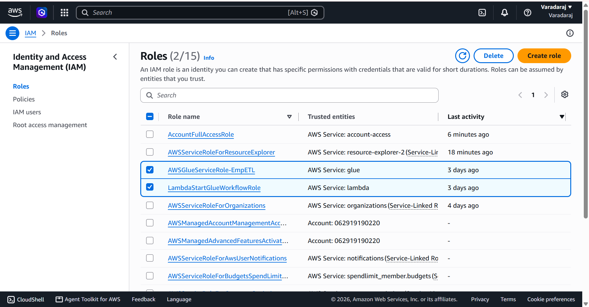
> *Both roles created: `AWSGlueServiceRole-EmpETL` and `LambdaStartGlueWorkflowRole`.*
>
> 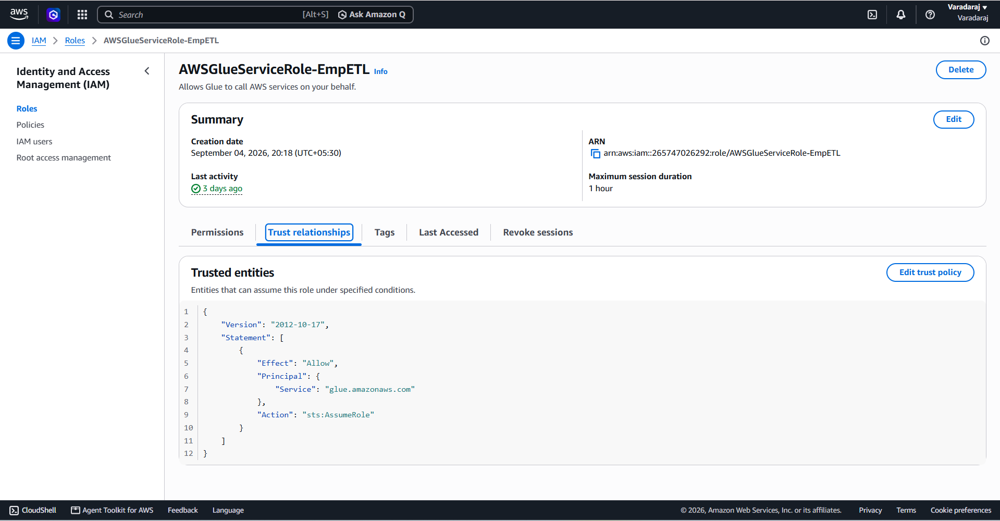
> *Glue role trusts `glue.amazonaws.com`.*
>
> 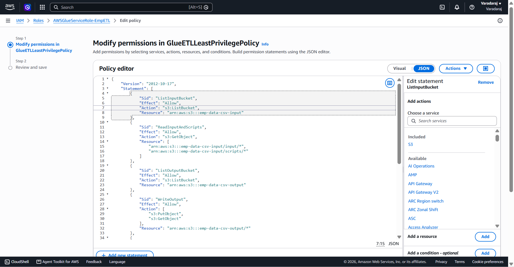
> *`GlueETLLeastPrivilegePolicy` — least-privilege S3, Glue Catalog, and CloudWatch Logs access.*
>
> 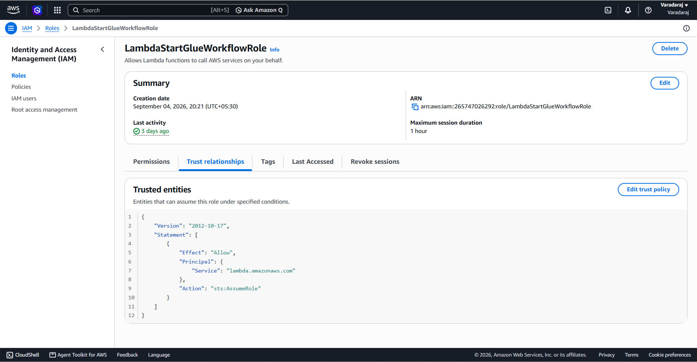
> *Lambda role trusts `lambda.amazonaws.com`.*
>
> 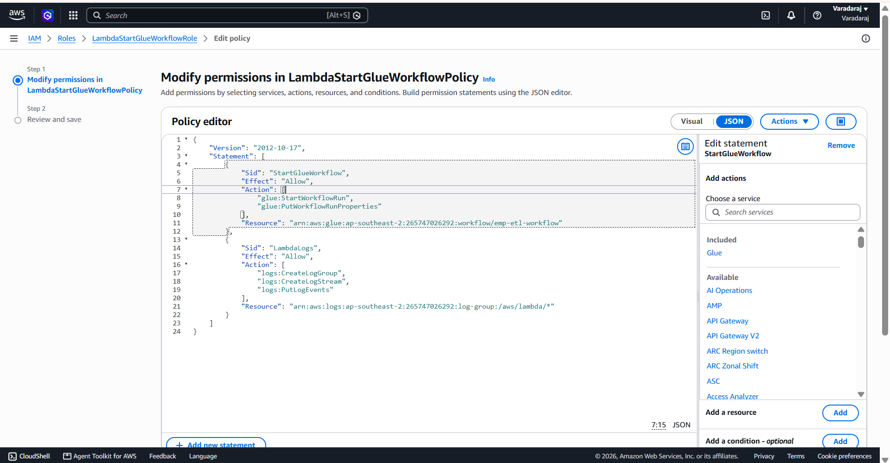
> *`LambdaStartGlueWorkflowPolicy` — scoped `glue:StartWorkflowRun` and CloudWatch Logs access.*

---

### Step 3 — Glue ETL Job

**Job:** `emp-etl-job` — Python Shell engine, IAM role
`AWSGlueServiceRole-EmpETL`, Python 3.9, 1/16 DPU.

**Job parameters:**


| Key             | Value                              |
| ----------------- | ------------------------------------ |
| `--INPUT_PATH`  | `s3://emp-data-csv-input/input/`   |
| `--OUTPUT_PATH` | `s3://emp-data-csv-output/output/` |

**Script (`glue_job.py`) behavior:**

- Reads every CSV under `INPUT_PATH` (folder mode, unions all files)
- Drops exact duplicate rows (added after testing revealed re-processing of
  lingering old files)
- Converts `salary` to numeric, drops unparseable rows
- Adds `bonus = salary × 0.10`, rounded to 2 decimals
- Writes result as a uniquely-named CSV (`part-<uuid>.csv`) to `OUTPUT_PATH`

> ⚠️ **Known issue hit & resolved:** the job initially failed repeatedly with
> `CommandFailedException: Script file doesn't exist`, caused by Glue
> Studio's "upload script" flow not correctly persisting to its internal
> managed assets bucket. Fixed by deleting and recreating the job from a
> blank script editor, then pasting the script directly rather than
> uploading a file.

> 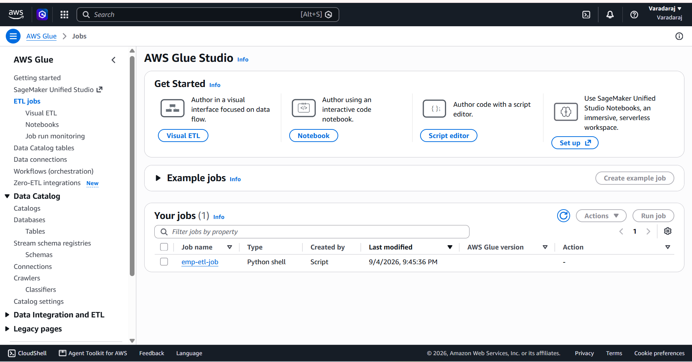
> *`emp-etl-job` — Python Shell, IAM role, Python 3.9, DPU settings.*
>
> 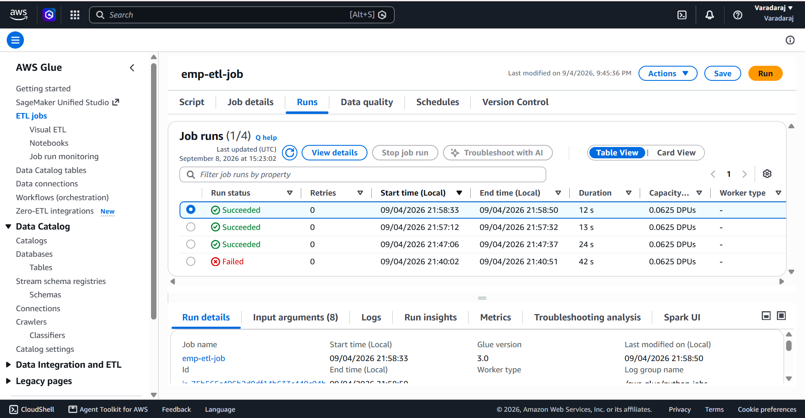
> *Successful job runs in the Runs tab.*

---

### Step 4 — Glue Crawler

**Database:** `emp_etl_db` (created first, since the crawler needs a target)

**Crawler:** `emp-output-crawler`

- Data source: `s3://emp-data-csv-output/output/`
- IAM role: `AWSGlueServiceRole-EmpETL`
- Target database: `emp_etl_db`
- Schedule: On demand (triggered only via the Workflow)

> 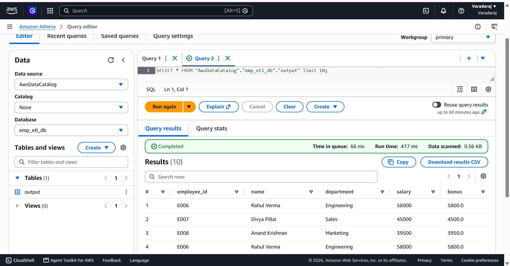
> *`emp_etl_db` visible in the Glue Data Catalog (viewed via Athena).*
>
> 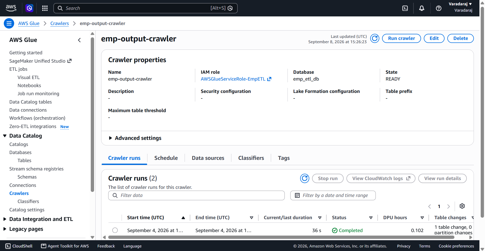
> *`emp-output-crawler` configuration and run status.*

---

### Step 5 — Glue Workflow

**Workflow:** `emp-etl-workflow`

```
[emp-etl-start-trigger] (ON DEMAND)
        │
        ▼
   [emp-etl-job]
        │
        ▼
[emp-etl-crawler-trigger] (Conditional: ALL watched events = Job Succeeded)
        │
        ▼
 [emp-output-crawler]
```

> 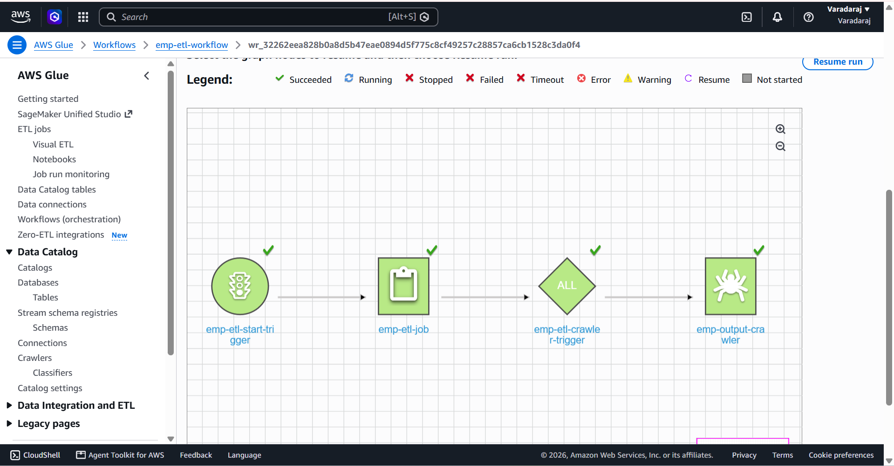
> *Workflow graph: `emp-etl-start-trigger` → `emp-etl-job` → `emp-etl-crawler-trigger` → `emp-output-crawler`.*

---

### Step 6 — Lambda Function

**Function:** `start-emp-etl-workflow` — Python 3.12, execution role
`LambdaStartGlueWorkflowRole`.

```python
import boto3

glue = boto3.client('glue')
WORKFLOW_NAME = 'emp-etl-workflow'

def lambda_handler(event, context):
    record = event['Records'][0]
    bucket = record['s3']['bucket']['name']
    key = record['s3']['object']['key']

    file_path = f's3://{bucket}/{key}'
    print(f"New file detected: {file_path}")

    response = glue.start_workflow_run(Name=WORKFLOW_NAME)
    run_id = response['RunId']

    glue.put_workflow_run_properties(
        Name=WORKFLOW_NAME,
        RunId=run_id,
        RunProperties={'triggering_file': file_path}
    )

    print(f"Started workflow run {run_id} for {WORKFLOW_NAME}")
    return {'statusCode': 200, 'body': f'Started workflow {WORKFLOW_NAME}, run ID {run_id}'}
```

**S3 trigger:** bucket `emp-data-csv-input`, event `s3:ObjectCreated:*`,
prefix `input/`, suffix `.csv`.

> 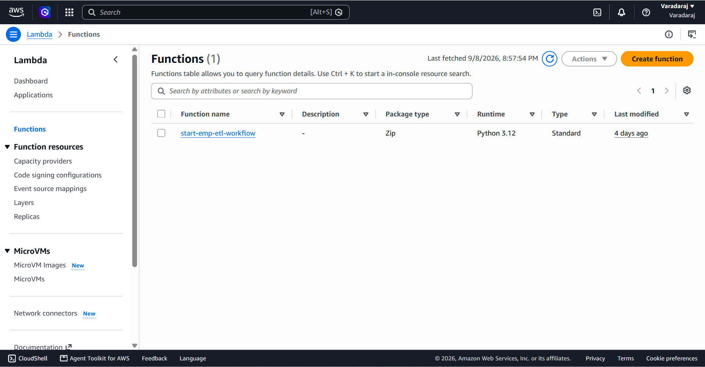
> *`start-emp-etl-workflow` visible in the Lambda console.*
>
> 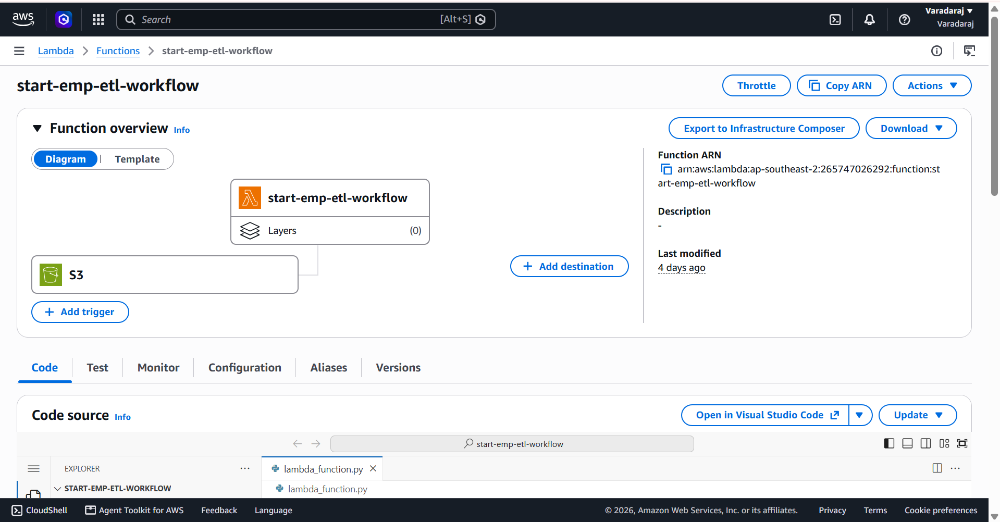
> *Lambda code editor showing the Python handler.*
>
> 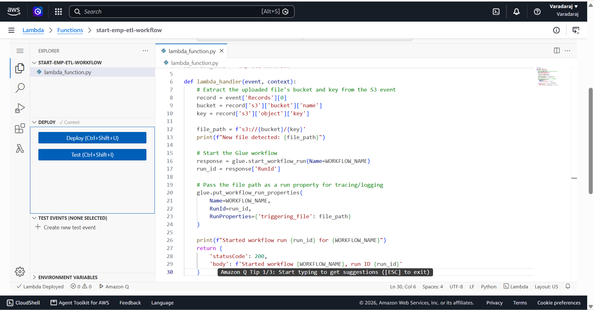
> *Lambda's S3 trigger configuration (prefix `input/`, suffix `.csv`).*

---

### Step 7 — End-to-end manual test

1. Uploaded `employees3.csv` to `emp-data-csv-input/input/`
2. Lambda fired → logs confirmed detection and workflow start
3. Glue Workflow ran end-to-end — all four nodes green
4. Output verified in `emp-data-csv-output/output/`: CSV with `bonus` column
   correctly computed
5. Data Catalog populated under `emp_etl_db`

> *End-to-end test screenshots not captured separately — see the Glue Job run
> (`aws_glue_job.png` / `glue_job_runs.png`) and Workflow (`workflow.png`)
> screenshots above, which confirm the same successful run.*

**Result:** full pipeline confirmed working end-to-end, manually.

---

## Part B — CloudFormation + GitHub Actions CI/CD

The manual pipeline above was fully recreated as Infrastructure-as-Code, so
it can be deployed and destroyed repeatably with no console clicking.

### Why a second, independent copy

Rather than risk the original manually-built resources, every resource name
in the CloudFormation version is suffixed `-v2` (buckets, IAM roles, Glue
job/crawler/workflow, Lambda) so both can coexist in the same AWS account
without any naming collisions.


| Resource        | Manual (Part A)               | CloudFormation (Part B)          |
| ----------------- | ------------------------------- | ---------------------------------- |
| Input bucket    | `emp-data-csv-input`          | `emp-data-csv-input-v2`          |
| Output bucket   | `emp-data-csv-output`         | `emp-data-csv-output-v2`         |
| Glue database   | `emp_etl_db`                  | `emp_etl_db_v2`                  |
| Glue job        | `emp-etl-job`                 | `emp-etl-job-v2`                 |
| Crawler         | `emp-output-crawler`          | `emp-output-crawler-v2`          |
| Workflow        | `emp-etl-workflow`            | `emp-etl-workflow-v2`            |
| Lambda          | `start-emp-etl-workflow`      | `start-emp-etl-workflow-v2`      |
| Glue IAM role   | `AWSGlueServiceRole-EmpETL`   | `AWSGlueServiceRole-EmpETL-v2`   |
| Lambda IAM role | `LambdaStartGlueWorkflowRole` | `LambdaStartGlueWorkflowRole-v2` |

### Repository layout

```
emp-etl-pipeline/
├── README.md
├── emp-etl-pipeline-v2.yaml          # CloudFormation template
├── glue_job.py                       # Glue ETL script (auto-uploaded on deploy)
├── csv_files/                        # Drop a CSV here to trigger the pipeline
│   └── employees3.csv
├── output_files/                     # Pipeline output, auto-committed back
│   └── part-<uuid>.csv
└── .github/
    └── workflows/
        └── deploy-emp-etl-pipeline.yml
```

### How authentication works

Access to the AWS account was granted by the account owner via an email
invite (console access only, no password). Since GitHub Actions needs
programmatic (API) credentials, the account owner separately created an IAM
access key (Access Key ID + Secret Access Key) with CLI-based use, which is
stored as encrypted **GitHub Secrets**:

- `AWS_ACCESS_KEY_ID`
- `AWS_SECRET_ACCESS_KEY`

> *GitHub Secrets screenshot not captured — for security, avoid screenshotting
> this page even with values hidden; the secret names alone
> (`AWS_ACCESS_KEY_ID`, `AWS_SECRET_ACCESS_KEY`) are documented above.*

### CloudFormation template highlights

`emp-etl-pipeline-v2.yaml` provisions, in one stack:

- Both S3 buckets (`DeletionPolicy: Retain` — survives stack deletion by
  default; CI/CD explicitly empties + removes them on a full `delete` run)
- Both IAM roles with least-privilege inline policies
- The Glue database, ETL job, crawler, and workflow with its two triggers
- The Lambda function (inline code via `ZipFile`)
- A Lambda-backed **custom resource** that configures the S3→Lambda event
  notification — this sidesteps the circular dependency that occurs if a
  bucket's `NotificationConfiguration` and the Lambda's invoke permission are
  declared directly on the bucket in the same template
- The custom resource's delete-handler gracefully tolerates a bucket that no
  longer exists (`NoSuchBucket`), so a manually-emptied or already-deleted
  bucket can never leave the stack stuck in `DELETE_FAILED`

> 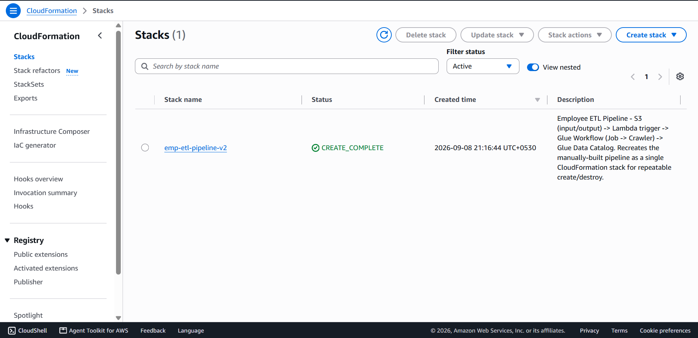
> *`emp-etl-pipeline-v2` at `CREATE_COMPLETE` in the CloudFormation console.*
>
> 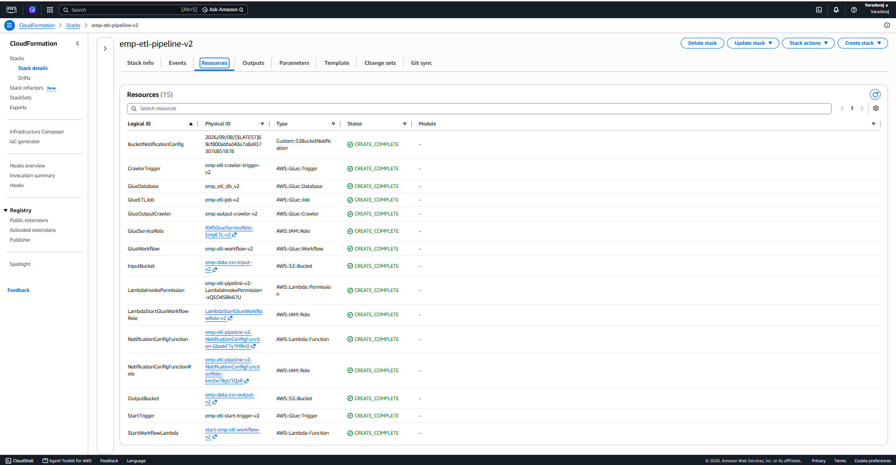
> *All resources created by the stack — S3 buckets, IAM roles, Glue job/crawler/workflow, Lambda, and the notification custom resource.*

### GitHub Actions workflow

`.github/workflows/deploy-emp-etl-pipeline.yml` has two jobs:

**`deploy`** — runs automatically on push to `main` when the template, Glue
script, workflow file, or `csv_files/**` changes; or manually via
**Run workflow → deploy**. Steps:

1. Validate the CloudFormation template
2. Deploy the stack (`aws cloudformation deploy`, idempotent)
3. Upload `glue_job.py` to the input bucket's `scripts/` prefix
4. If this push touched `csv_files/`, snapshot the output bucket, upload the
   new CSV(s) to `input/` (which fires the whole pipeline), then poll the
   output bucket every 20s (up to 10 minutes) for a new result file
5. Download that new output file and commit it back into `output_files/` in
   the repo automatically
6. Print the stack's outputs

**`delete`** — runs only via **Run workflow → delete**. Empties both S3
buckets, deletes the CloudFormation stack, and waits for confirmation.

> 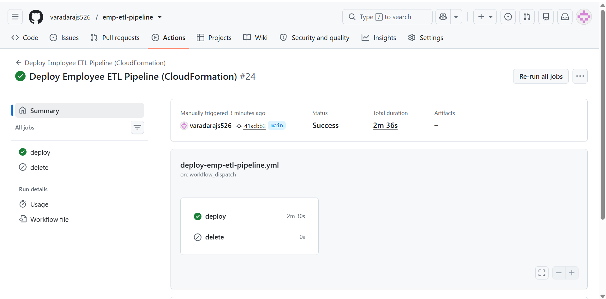
> *A successful `deploy` run — all steps green.*
>
> 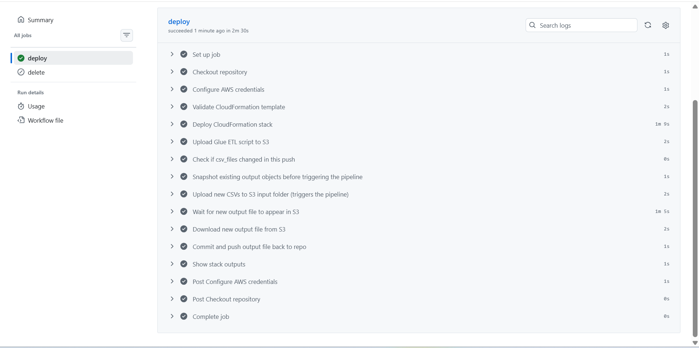
> *Step-by-step log: validate template → deploy stack → upload Glue script → (if triggered by a CSV push) upload CSV, wait for output, commit it back.*
>
> 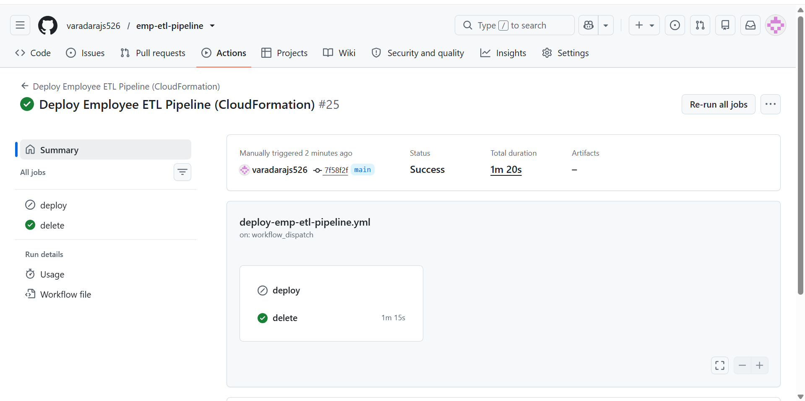
> *A successful `delete` run — buckets emptied, stack removed.*
>
> 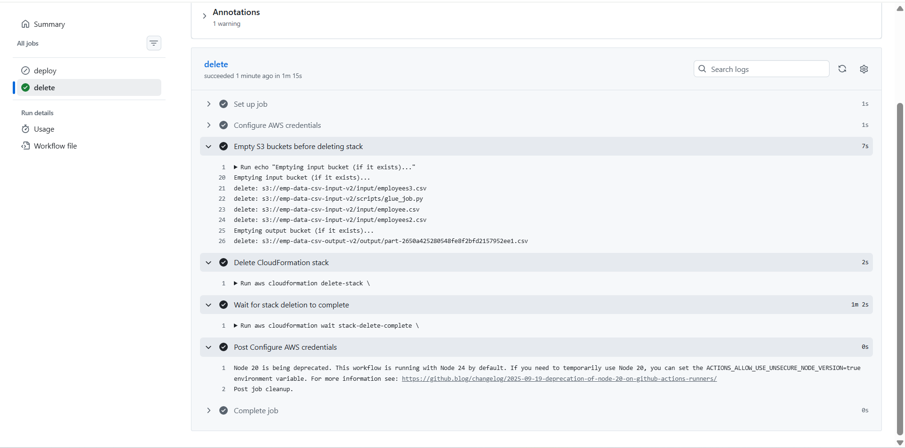
> *Step-by-step log: empty S3 buckets → delete stack → wait for deletion to complete.*
>
> *Auto-commit-to-`output_files/` screenshot not captured — see the
> Usage section above for the exact commit message format
> (`github-actions[bot]`, `[skip ci]`) this step produces.*

### Usage

**Deploy / update the pipeline**

```bash
git push origin main
# or: Actions tab → Run workflow → deploy
```

**Trigger the pipeline with a new CSV**

```bash
cp your_file.csv csv_files/
git add csv_files/your_file.csv
git commit -m "Trigger pipeline with new data"
git push
```

The processed output will appear automatically in `output_files/` within a
few minutes, committed by the `github-actions[bot]` user.

**Destroy the pipeline**

```
Actions tab → Run workflow → delete
```

### Issues encountered while building the CI/CD path


| Issue                                                            | Cause                                                                                                                           | Fix                                                                                   |
| ------------------------------------------------------------------ | --------------------------------------------------------------------------------------------------------------------------------- | --------------------------------------------------------------------------------------- |
| `DELETE_FAILED` on stack deletion                                | S3 buckets were non-empty                                                                                                       | Added an "empty buckets" step before`delete-stack` in the workflow                    |
| `DELETE_FAILED` on `BucketNotificationConfig`                    | Custom resource's delete Lambda crashed on`NoSuchBucket` when a bucket had already been removed out-of-band                     | Wrapped the delete handler in a try/except that treats a missing bucket as success    |
| `AWS::EarlyValidation::ResourceExistenceCheck` changeset failure | S3 bucket names remain briefly reserved for some time after deletion, even though`NoSuchBucket` is returned by normal API calls | Waited for the name to fully release, then redeployed                                 |
| Stack stuck in`REVIEW_IN_PROGRESS`                               | An earlier failed changeset left the stack in a non-terminal state                                                              | `delete-stack` on a `REVIEW_IN_PROGRESS` stack is safe — no real resources exist yet |
| Local template edits not taking effect                           | Downloaded file wasn't actually replacing the one in the repo folder                                                            | Verified with`findstr` before every commit going forward                              |

> *`DELETE_FAILED` example screenshot not included — see the "Change set
> status reason" and CloudWatch log excerpts referenced in the table above
> for the exact error text encountered.*

---

## Summary


|                  | Part A: Manual                   | Part B: CloudFormation + CI/CD         |
| ------------------ | ---------------------------------- | ---------------------------------------- |
| Setup time       | ~1–2 hours, click-through       | Minutes, one`git push`                 |
| Repeatable       | No — must be rebuilt by hand    | Yes — deploy/destroy on demand        |
| Risk of drift    | High (manual steps easy to miss) | Low — template is the source of truth |
| Destroy          | Manual, resource-by-resource     | One click (`delete` workflow)          |
| Trigger a run    | Upload CSV via console           | Push CSV to`csv_files/` in the repo    |
| Retrieve results | Download from S3 console         | Auto-committed to`output_files/`       |
